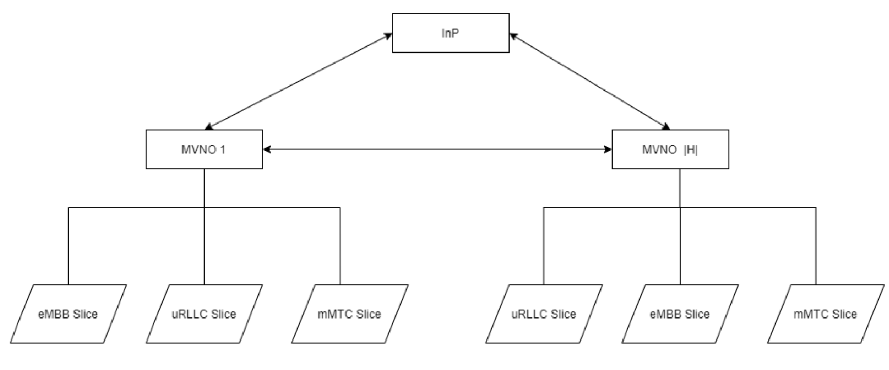

# sdn_slicing_blueprint
Softwarized and Virtualized mobile networks Project A.Y. 2020-21 - University of Trento

# Short Summary of the project
5g networks can be sliced into three major use cases. Enhanced Mobile Broadband (eMBB), Ultra-Reliable Low Latency Communication(uRLLC), Massive Machine Type Communication (mMTC) these slices are totally independent to provide users the best QoS and security. 5g network slices enable different opportunities for the different technologies to provide better services. For example, a software-defined network provides flexibility and affords the control with a global view of the entire network. It is also used to develop virtualized control plane which helps to fulfill the space between network management and service allocation using intelligent network management techniques.
Radio resource management helps to manage efficiently the radio resources in the wireless networks. There are different techniques: handover control, call admission control, scheduling and power control, etc.
Handover control is defined as when a user moves from one coverage area to another, handover control makes sure that sure stays connected.
There are many algorithms that help to improve handover control. but here we will talk about the specific one.
Here we will discuss the design of a **handover algorithm** that is based on the **Markov chain** decision process.
The whole idea of slicing is that it allows multiple self-contained networks on top of a commonly shared infrastructure. 
Model 
In the model of the algorithm, the shared infrastructure is known as the Infrastructure provider (Inps). It provides resources to the tenants like mobile virtual network operators (MVNOs). This is a hierarchy-based system that provides the resources all the way down to the slices as you can see in the diagram.

All the slices have their specific use cases and resources but they are not responsible for accepting any calls. In the model, the call refers to any connected device to the network or wanted to connect. But MVNO is taking care of accepting calls from different users with the help of the **call admission control algorithm** which is implemented on MVNO.

# Algorithm implementations
Basically the implementation of the algorithm consists of six classes: Simulator, Use Case, Slice, Slices, Intra Calculations, and InterCalation. which can be found in the code part.
