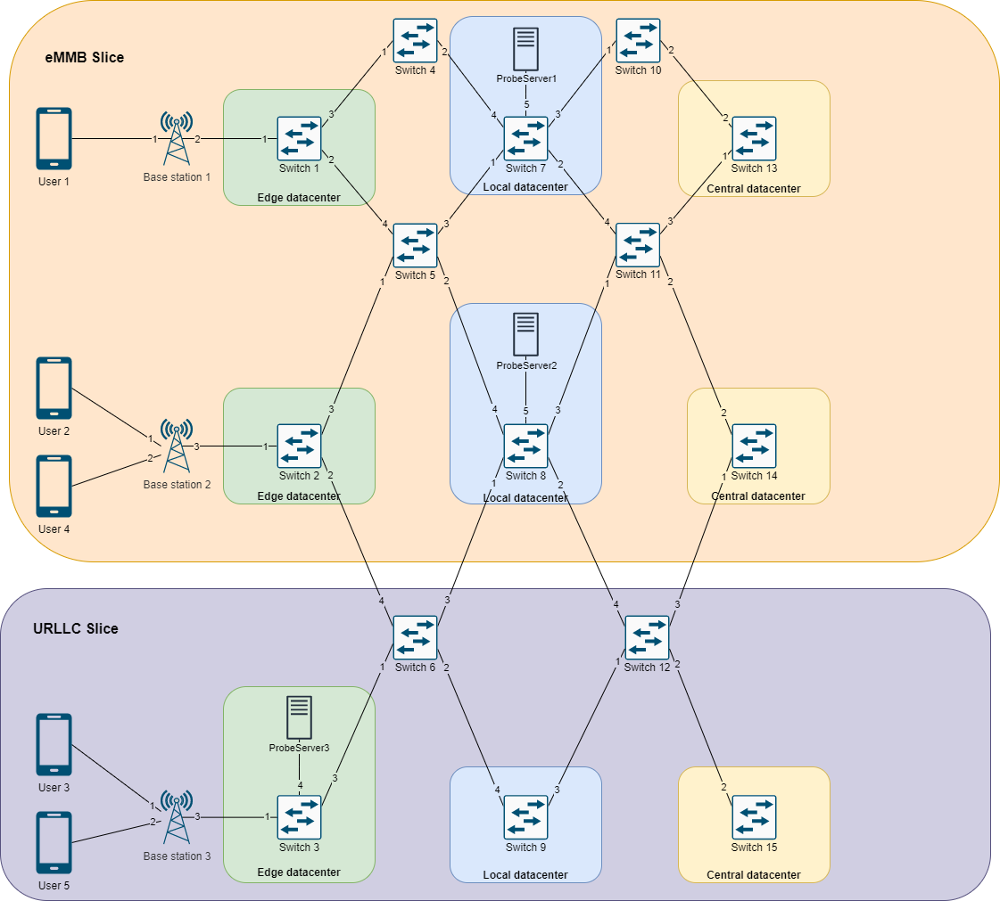

# SDN Slicing Blueprinting
Softwarized and Virtualized mobile networks Project A.Y. 2020-21 - University of Trento

- Giuseppe Superbo, ID: 220376
- Luca Staboli, ID: 220374


## 1) Introduction
As 5G wireless access capabilities offer more opportunities than the previous mobile network generations, it is possible to identify three major use cases which have different connectivity requirements: Enhanced Mobile Broadband (eMBB), Ultra-Reliable Low Latency Communication(uRLLC), Massive Machine Type Communication (mMTC). 


*5G Network Slicing - Viavi solutions: https://www.viavisolutions.com/es-es/node/71717*

The reference paper for the requirements of each use case application adopted during this project is the following: https://www.ericsson.com/en/reports-and-papers/white-papers/5g-wireless-access-an-overview .


The goal of this project is to develop a blueprint from which it is possible to slice a predefined infrastructure depending on which applications  are going to be deployed in the network. These slices are totally independent of each other in order to provide users the best QoS and isolation. 5g network slices enable different opportunities for the different technologies to provide better services. 

## 2) Used tools
The project has been developed by using ComNetsEmu (https://www.granelli-lab.org/researches/relevant-projects/comnetsemu-sdn-nfv-emulator) which is a tesed and network emulator. It extends Mininet functionalities to support an enhanced emulation of NFV/SDN network applications. It includes also other useful functionalities for network emulation. In this case the following applications were used:

- Mininet (http://mininet.org/) for building the virtual network entities;
- Ryu (https://ryu-sdn.org/) for building the controller of the virtual network;
- Wireshark (https://www.wireshark.org/) for capturing packets information during the emulation.

## 3) Infrastructure design and configuration
By taking as reference the previously shown 5G network slicing high level diagram, the reference infrastructure for this project includes, 15 switches and 3 base stations, placed in the following way:


9 of the 15 switches represent datacenters, virtually located in different distances from the base stations. The switches located in the far right are the most distant from the base stations.

In the configuration file *params.conf* it is possible to set the following characteristics of the network:

* ``` slices_configuration = "EMU" ```, with this parameter it is possible to choose which slice configuration has to be deployed. Each character of the parameter refers to a set of datacenters (Edge, Local and Center) and so a maximum of 3 slices it is possible to configure. The accepted characters for the configuration are: 
    - "E" for eMBB use case;
    - "M" for mMTC use case;
    - "U" for URLLC use case.

* ``` users_configuration = 'user1', 'BS1', 'user2', 'BS2', 'user3', 'BS3', 'user4', 'BS2', 'user5', 'BS3' ```, with this parameter it is possible to place a set of users to specific base stations. It is important to write a user followed by his base station as Ryu Controller only accept the list of user in this format.

In order to run the network it is necessary to run the following commands:
* ```ryu-manager ryu_slice.py --config-file params.conf```, ryu controller will be deployed and it will be available on port 6633.
* ```sudo python3 topology.py```, mininet will deploy the network and execute the mininet client from which it is possible to interact with the deployed network.

## 3) Testing scenarios
In order to test the behaviour of the network, depending on the configuration, 3 main scenarios were tested during this project.
### "EMU" configuration

### "EEU" configuration

### "EEE" configuration


